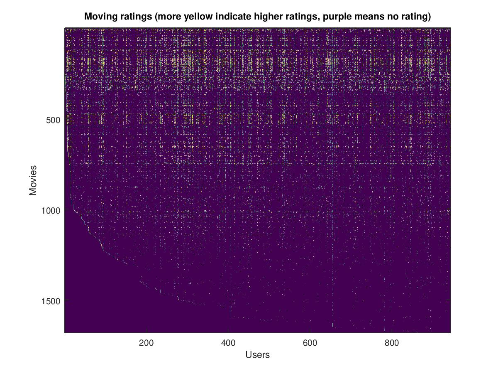

# recommender-systems
Implementing and applying the collaborative filtering learning algorithm to a dataset of movie ratings

## Table of Contents
* [Movie ratings dataset](#movie-ratings-dataset)
* [Collaborative filtering learning algorithm](#collaborative-filtering-learning-algorithm)
* [Learning movie recommendations](#learning-movie-recommendations)
  * [Recommendations](#recommendations)

## Movie ratings dataset
The binary file **data/movies.mat** contains the variables ```Y```
and ```R```. 


* Let ```num_movies``` be the number of rows in ```Y```
, which is also the number of movies,
and ```num_users``` be the number of columns in ```Y```
, which is also the number of users.
```Y(i,j)``` stores the rating (from 1 to 5)
on the *ith* movie given by user *j*.
The matrix ```R``` has the same dimensions as ```Y```
(also ```num_movies``` *x* ```num_users```). 

* ```R(i, j) = 1``` if the *ith* movie was rated by the *jth* user.
Otherwise, ```R(i, j) = 0```.

The script in **tests/visualizeData.m** helps us visualize ```Y``` by
by computing the average movie rating for the first movie and outputting
the average rating to the screen. It also plots ```Y``` as colored image.



The binary file **data/movieParams.mat** contains the variables
```X```, ```Theta```, ```num_movies```, ```num_users```, and
```num_features```. 


* ```num_movies``` and ```num_users``` are the same as the
variables defined earlier. 

* ```num_features``` is the number of columns in ```X```,
which is also the number of dimensions in the dataset.

* ```X``` is a ```num_movies``` *x* ```num_features``` matrix.
```X(i)``` is the feature vector for the *ith* movie.
```X(i, k)``` is the *kth* feature of the *ith* movie's feature vector.

* ```Theta``` is a ```num_users``` *x* ```num_features``` matrix.
```Theta(j)``` is the parameter vector for the *jth* user.
```Theta(j, k)``` is the *kth* parameter for the *jth* user's paramemter vector.


## Collaborative filtering learning algorithm
The function ```cofiCostFunc()``` in **src/cofiCostFunc.m** takes in the parameters
```params```, ```Y```, ```R```, ```num_users```, ```num_movies```, ```num_features```
and ```lambda``` and returns ```[J, grad]```.
* Arguments
  * ```Y```, ```R```, ```num_users```, ```num_movies```, ```num_features``` are defined
  the same as they are earlier.
  * ```params``` is a unrolled vector containing ```X``` and ```Theta```. This allows
  us to use packaged minimizers such as ```fmincg```.
  * ```lambda``` is the regularization parameter.
* Return values
  * ```J``` is the cost
  * ```grad``` is the gradient

## Learning movie recommendations
### Recommendations
